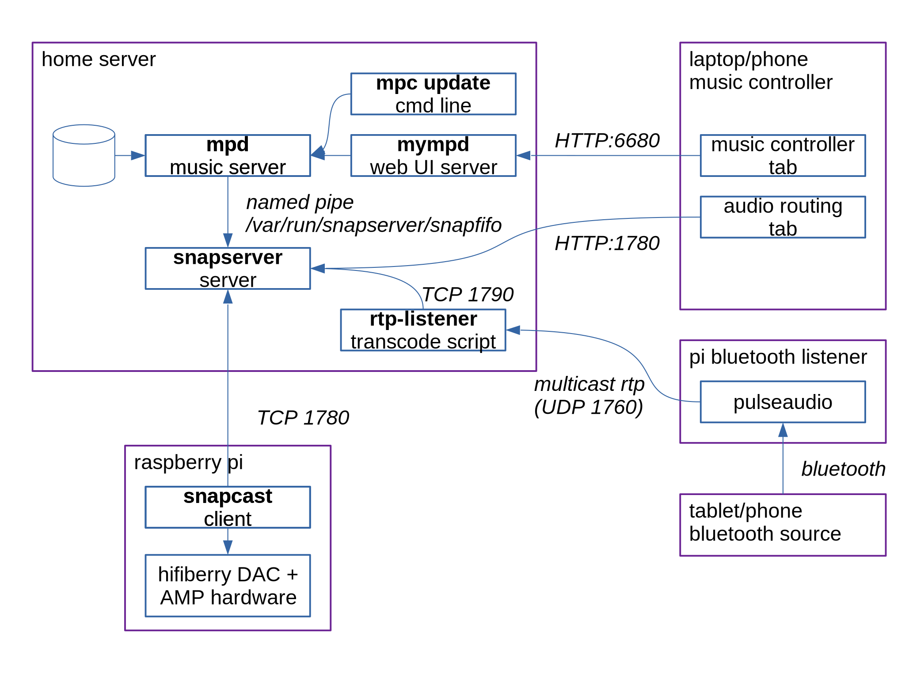

# Recipe for Synchronized Whole-House Audio

## The dish

This recipe makes

* a whole-house audio system with any number of rooms

* multiple playlist "channels" so different users can have
  their own settings (who even likes shuffle!?),
  play different music in different rooms, or just
  keep their own playlists paused while others are using the system.

* a bluetooth input path for playing live content off of phones or
  tablets.

## Backstory

Like any good internet recipe, this one begins with my life story.
Skip ahead to the next header.

Some years ago our Squeezebox player died. We kept the janky perl daemon and
replaced the player with a raspberry pi, using its built-in DAC connected to
the same 1980s-era audio amp, driving two sets of speakers. A house renovation
demolished the speaker wiring between rooms, and it was finally time to move
into the modern era.

Two neat innovations have come along in the two decades since we bought the
squeezebox. The first is software: the Snapcast time-synchronized audio player
lets you scatter tiny wifi receivers around your house and have them all play
music synchronized together. The second is hardware: the HiFiBerry Amp puts a
60W audio amp into a pi-hat form factor powered by a surplus laptop charger.

This whole story hinges on raspberry pis, which have been unobtanium for a
couple years, but hopefully the situation returns to normal soon.

This system is exactly the sort of thing that appeals to me: open source
everything. But of course that means you get to (have to) choose bits and
pieces at each layer. Here are the choices I've put together.

## System Design

The hub of the system is the
[snapcast audio server](https://github.com/badaix/snapcast).
It provides time-synced audio to client devices from audio input streams
arriving on Unix fifos or TCP pipes.

Music is supplied to snapserver from
[mpd](https://github.com/MusicPlayerDaemon/MPD), a music server that
scans and indexes music files in local server storage.
Users control the mpd playlist via
[mympd](https://github.com/jcorporation/myMPD),
a web-based UI.

Music can also be streamed in via Bluetooth, connecting to the system
from a phone or tablit as if it were headphones.

## Set up snapserver and some clients

[Set up snapserver](./snapserver.md)

[Set up a snapcast client on a raspberry pi](./snapclient.md)

## Source music from local storage using mpd

[Set up the music player daemon on your server](./mpd.md)

[Set up the music player web UI](./mympd.md)

## Add extra "stations"

[Add extra mpd channels](./mpd-channels.md)

## Source music from a Bluetooth source

While Bluetooth is nice for listening to music, the high latency will make it
unusable for watching videos.

[Configure your snapserver to accept a TCP stream](snapserver-bluetooth-stream.md)

[Set up a pi to forward bluetooth audio to your server as RTP](bluetooth-receiver.md)

[Set up a service to convert RTP into snapserver TCP](rtp-forwarder.md)
