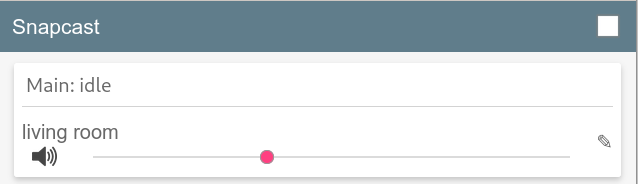

# Set up a snapcast client on a raspberry pi

Audio streams to the various rooms in your house via wifi
(or ethernet), landing at a raspberry pi, where it is converted
to analog, amplified, and delivered to speakers.
With the advent of the class D amplifier, a high power audio amp
can fit in a tiny space -- like right on top of a pi!

So for each endpoint in my system, I used:

* A raspberry pi 4 (which I hope can be purchased again someday 🙄)

* [HiFiBerry Amp2](https://www.hifiberry.com/shop/boards/hifiberry-amp2/).

* A box for the pi and amp. [I 3D printed mine.](https://www.thingiverse.com/thing:2781614)

* A 60-90W laptop power supply. I bought a lot of old-style Thinkpad power
  bricks from ebay for $5/unit.

* Speakers.
  Our living room still has decades-old hifi speakers with ten-inch drivers.
  We have in-wall speakers in the kitchen and bookshelf speakers in
  other rooms.  Monoprice is a good sources for decent inexpensive speakers.

You could certainly use other DAC and amp combinations.
You can even use the terrible 8-bit DAC that's built into the pi; I did
that for a few bleak years.
Unless you already have an amp lying around, it's going to be hard to
beat the $50 Amp2.

## Configure the SD cards.

I built my devices starting with HiFiBerry's OS distribution.
(It was a bit clumsy; see [future work](./future-work.md).)
I used a script to set the SD card up for complete automation.

* On a laptop or whatever machine is going to write the SD card,
download the
[HiFiBerryOS image](https://www.hifiberry.com/hifiberryos/)
appropriate for your pi model.

```
mkdir images-deleteme
curl https://www.hifiberry.com/images/hifiberryos-pi4.zip -o images-deleteme/hifiberryos-pi4.zip
```

* Configure the [sdcard installer](hifiberry-setup/prepare-sdcard.py):
First, modify the SUBSTITUTIONS at the top of the python file to
tell the client where the server is and how to access wifi.
Then link to your ssh pubkey so you can ssh into the pi when it's
running.
```
ln -s $HOME/.ssh/id_rsa.pub pubkey
```

* Plug in an sdcard and run the installer.
Be careful to specify the correct target device!
It will construct the sdcard image and add the credentials you set up above.
```
sudo hifiberry-setup/prepare-sdcard.py /dev/<sdx> pi4
```

## Boot the pi.

* Move the sdcard to the hat-wearing pi and let it boot. Give it a couple
minutes to resize the filesystem and reboot and whatever.
Watch the snapserver web ui (port 1780 on your audio server). When the
client device comes up, you should see it appear in the UI:



Try playing music again to it the
[ffmpeg test from the server setup](./snapserver.md).
You can rename the client with the pencil icon.
